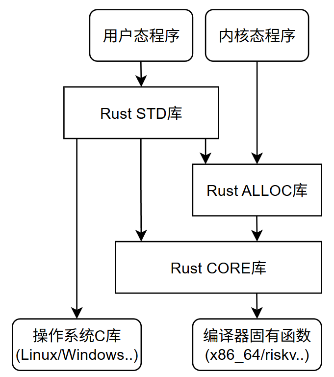
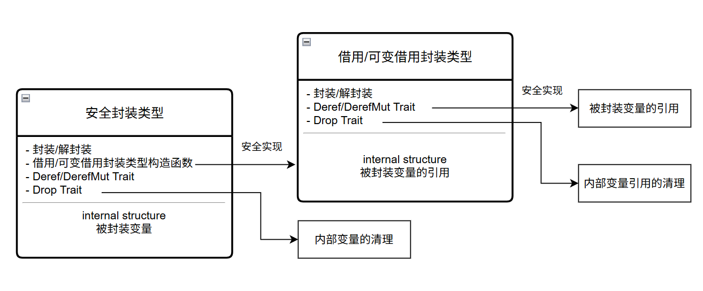

# 标准库概述
## Rust标准库体系
Rust的标准库主要包含三个组件:  
- CORE库: 语言核心库
- ALLOC库: 智能指针库
- STD库: 用户态库

  
### CORE库
CORE库可用于OS内核编程与用户态编程, 不依赖操作系统, 是与硬件CPU架构无关的可移植库  
CORE库主要包含以下几个部分:  
1. 编译器内置固有(intrinsic)函数  
固有函数由编译器实现, 一般使用汇编提供最佳性能, CORE库调用对应接口  
包括内存操作函数, 数学函数, 位操作函数, 原子变量操作函数等  
2. 内存操作  
CORE库内存操作包括三个模块: alloc模块, mem模块, ptr模块  
Rust中绝大多数不安全代码语法都存在于这3个模块  
3. 基本特征(Trait)  
CORE库会实现部分基本trait, 包括运算符(OPS) Trait, Marker Trait(通常由编译器实现), 迭代器(Iterator) Trait, 类型转换Trait
4. 基本数据类型  
基本数据类型为Rust语法层面内置的类型  
CORE库为基本类型实现了基本特征与部分特有函数  
Rust的基本类型包括12种整型, 2种浮点类型, 布尔类型(`bool`), 字符类型(`char`)和单元类型(`()`)  
5. Option/Result类型  
Option/Result类型不是内嵌类型, 且无特殊之处, 但通常认为其是Rust不可或缺的部分并被广泛使用, 故在CORE库中实现  
6. 数组, 切片与Range类型  
***问题: 元组及其支持的trait由谁实现?***  
***问题: 数组, 切片即Range类型本身由谁实现?编译器还是标准库***
7. 字符串及格式化  
***问题: 字符串是Rust语言内置的类型吗, 不是的话由谁实现***
CORE库为字符串实现了基本特征, 格式化放法与一些特有函数  
8. 内部可变性类型  
CORE库的内部可变性类型包括`UnSafeCell<T>`, `Cell<T>`, `RefCell<T>`等  
***问题: 这些类型是由谁实现的?***
CORE库为这些类型实现了基本特征与特征函数  
9. 其他  
CORE库还包含了FFI(外部函数接口), 时间库, 异步库  
### ALLOC库
ALLOC库的所有类型都基于堆内存, 包括智能指针类型, 集合类型, 容器类型  
ALLOC库仅依赖于CORE库, 其主要内容如下:  
1. 内存的申请与释放  
Allocator Trait及其实现者Global单元类型  
2. 基础智能指针类型  
包括`Box<T>`, `Rc<T>`  
3. 动态数组智能指针类型  
包括`RawVec<T>`, `Vec<T>`  
4. 字符串智能指针类型  
包括`String`  
5. 并发安全基础智能指针类型  
包括`Arc<T>`  
6. 集合类型  
包括`LinkList<T>`, `VecQueue<T>`, `BTreeSet<T>`, `BTreeMap<T>`  
### STD库
STD库建立在OS的系统调用(SYSCALL)基础上, 只适用于用户态编程  
STD库的主要内容如下:  
1. 对CORE库及ALLOC库的内容进行映射  
2. 实现进程管理与进程间通信  
3. 实现线程管理, 线程间临界区/互斥锁, 消息通信及其他线程相关内容  
4. 实现文件, 目录及OS环境
5. 实现输入, 输出
6. 实现网络通信
## Rust重要概念
### 基于泛型的函数与Trait
Rust是一门以泛型为基础的语言, 泛型与语法共生  
Rust可以直接对泛型定义函数和Trait  
```rust
//T: ?Sized对应任何类型, 不带约束的T实际是T: Sized
impl<T: ?Sized> Borrow<T> for T {
    fn borrow(&self) -> &T { self }
}
```
这个impl为通过为泛型T: ?Sized实现Borrow Trait为所有的具体类型实现了该Trait  
直接对泛型定义Trait和函数, 是Rust支持函数式编程的基础  
### 泛型约束层次
T: trait约束泛型定义的范围  
Rust的泛型约束形成了一种从一般到特殊的层次结构:  
1. 基层泛型  
T: ?Sized约束定义全部类型, 包括内存大小固定的类型(T: Sized)及内存大小不固定的类型  
2. 一级子层泛型  
内存大小固定类型`T`, 裸指针类型`*const T`/`*mut T`, 切片类型`[T]`, 数组类型`[T;N]`, 引用类型`&T`/`&mut T`, 
Trait约束类型`T:trait`, 泛型元组`(T, U, ...)`, 泛型复合类型`stuct<T>`/`enum<T>`/`union<T>`, 具体类型如基础类型, `&str`, `Sting`  
3. 二级子层泛型  
对一级子层泛型赋予具体类型, 如`*const u8`/`[i32]`; 或一级子层对`T`做具化, 如`*const [T]`/`struct<T: trait>`  

实现在上层泛型的函数和Trait也会在对应的下层泛型中实现  
### Rust内存安全
Rust编译器仅提供有限的安全特性  
1. 编译器提供的安全特性  
   &nbsp;&nbsp;变量必须初始化后才能使用 
   &nbsp;&nbsp;引用必须是内存对齐的, 引用指向的变量必须已经初始化  
   &nbsp;&nbsp;模块成员默认为私有, 结构成员对模块外代码默认为私有  
   &nbsp;&nbsp;严格的类型及类型无效值  
   &nbsp;&nbsp;基本类型都满足`Copy`, `Send`, `Sync`等Auto Trait  
   &nbsp;&nbsp;线程间转移变量必须支持Send, 线程间共享变量必须支持Sync  
   &nbsp;&nbsp;if及match必须覆盖所有条件分支  
2. 编译器无法确定安全的特性  
   &nbsp;&nbsp;裸指针解引用  
   &nbsp;&nbsp;支持所有FFI(外部函数接口)调用, unsafe固有函数调用  
   &nbsp;&nbsp;对类型产生无效类型值  
   &nbsp;&nbsp;嵌入式汇编使用  
3. 编译器为安全提供的语法工具  
   &nbsp;&nbsp;所有权, 生命周期  
   &nbsp;&nbsp;自动调用Drop Trait  
   &nbsp;&nbsp;自动解引用  

Rust标准库利用编译器提供的这些安全特性实现外部接口(类型, 函数)供用户调用, 这些接口(非unsafe)承诺保证内存安全  
开发者需要为自己实现的类型, 函数的内存安全负责  
Rust的内存安全指开发者利用编译器提供的基础设施创建内存安全的类型和函数, 保证程序在编译期就能发现内存安全bug, 或在运行中出现内存安全问题时立刻退出程序, 保护第一现场  
Rust标准库就是利用Rust内存安全的最好的例子, 其源代码中包含大量内存不安全源代码, 这些代码的安全性由Rust标准库开发者保证  
### Rust安全封装类型
安全封装类型变量封装了代码真正感兴趣的变量(内部变量)并拥有其**所有权**, 外部代码只能通过封装类型提供的trait与函数访问内部变量, 通过此实现内部变量的内存安全  
安全封装类型可以通过实现`Deref`/`DerefMut` Trait, 借助Rust自动解引用语法获得内部变量的引用/可变引用  
安全封装类型通过Drop Trait完成对内部变量的清理  
***借用/可变借用封装类型***是为了方便的访问安全封装类型的内部变量而定义的, 能够封装内部变量的借用/可变借用变量, 通过这种方式实现封装的**内部可变性**  
如`Ref<T>/RefMut<T>`是与安全封装类型`RefCell<T>`配合的借用/可变借用类型  
借用/可变借用封装类型通过调用安全封装类型变量的构造函数来创建, 这些构造函数实现了内部变量借用/可变借用的生命周期安全  
如`RefCell<T>::borrow`函数创建`Ref<T>`, `RefCell<T>::borrow_mut`函数创建`RefMut<T>`  
借用/可变借用封装类型通过实现`Deref`/`DerefMut` Trait, 借助Rust自动解引用语法获得内部变量的引用/可变引用  
借用/可变借用封装类型通过实现`Drop` Trait实现对内部变量引用/可变引用的清理工作, 如减少计数, 释放锁  
  
标准库安全封装类型:  
- `Option<T>`是解决值不存在的安全封装类型  
- `Box<T>`是堆内存的安全封装类型
- `Rc<T>`是一块内存被一个线程多处引用的安全封装类型  
- `Arc<T>`是一块内存被多个线程多处引用的安全封装类型  
- `Mutex<T>`是线程间临界区的安全封装类型
### 获取封装类型变量的内部变量
标准库实现多种方案简化获取内部变量的代码, 如下:  
1. 使用`?`运算符解封装  
若封装类型实现了`Try` Trait, 可以使用`?`运算符进行解封装并完成异常处理  
```rust
let a = Some(4);
assert_eq!(a?, 4);
```
2. 自动解引用  
若封装实现了`Deref`/`DerefMut` Trait, 利用Rust自动解引用语法获取引用  
3. 采用闭包  
可以采用闭包以函数式编程的方法接话代码  
```rust
//Option::map()
let len: usize = Some(String::from("Hello, World!")).map(|s| s.len())?;
```
4. 直接获取引用或裸指针  
对于指针相关及其他智能指针类型, 标准库定义了用于获取内部变量的裸指针及引用的标准函数  
```rust
as_ptr(self) -> *const T;               //获取智能指针内部变量的裸指针
as_mut_ptr(self) -> *mut T;             //获取智能指针内部变量的可变裸指针
as_ref<'a>(&self) -> &'a T;             //获取智能指针内部变量的引用
as_mut<'a>(&mut self) -> &'a mut T;     //获取智能指针内部变量的可变引用
```
5. 获取所有权  
标准函数`take()`与`replace()`用于获取内部变量的所有权且不消耗安全封装类型变量  